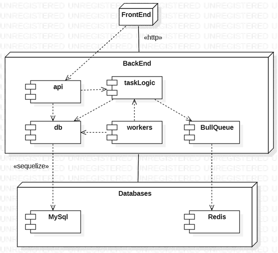

# Arquitectura de la Solución

Vamos a desarrollar una solución modular para manejar tareas de larga duración, donde cada componente estará especializado en una función específica dentro de un diseño basado en módulos.

Utilizaremos una cola de tareas para gestionar las tareas de larga duración y una base de datos relacional para almacenar y consultar el resultado de estas tareas.

## Requerimientos Funcionales

**RF1**: Iniciar tareas long running.

Generar un endpoint que permita iniciar tareas que requieren mucho tiempo para procesar. 
Debe aceptar solicitudes para iniciar tareas con parámetros configurables (como cantidad de registros a insertar).

**RF2**: Consultar estado de las tareas.

Generar un endpoint que permita consultar el estado de procesamiento de una tarea en ejecución.
Debe devolver el estado actual de la tarea.

## Componentes de la Arquitectura

**API REST**: Se encargará de recibir las solicitudes de los clientes, la consulta del estado de las tareas en ejecución y su encolamiento.

**Worker**: Procesará las tareas de larga duración de la cola.

**Cola de Tareas**: Gestionará la distribución de las tareas entre los workers.

**Base de Datos**: Almacenaremos el resultado de las tareas en MySql (base de datos relacional) y Redis (base de datos no relacional) a través de Bull Queue.

## Vista de Descomposición

### Representación Primaria


### Catálogo de Elementos

**Api:** contiene las rutas, dtos, el controlador y el archivo de ejecución.

**DB:** se encuentra el acceso a los datos, la definición de la base de datos con Sequelize y scripts de creación de tablas.

**TaskLogic:** define los servicios, el estado de las tareas y exporta la instancia de la cola de tareas.

**Utils:** define y exporta un adaptador para la cola de tareas.

**Workers:** contiene el procesamiento de las tareas de los workers.

**Config:** contiene la configuración de las conexiones a las bases de datos.

### Decisiones de Arquitectura

Se hace énfasis en el principio de diseño de cohesión REP (Reuse Equivalence Principle), enfocandonos en el paquete como unidad de reuso. 

## Vista de Tiers

### Representación Primaria



### Catálogo de Elementos

Se puede notar la arquitectura cliente - servidor, donde el *frontend* se comunica con la API del *backend*. 

El backend está compuesto por la **API**, **la lógica de manejo de tareas** y la **configuración y acceso a las bases de datos** (tanto *Redis* como *MySql*)**.

### Decisiones de Arquitectura

La decisión de los niveles de la arquitectura fue basada en la asignación de las responsabilidades primarias del problema y su desacoplamiento.

## Vista de Despliegue

### Representación Primaria


### Catálogo de Elementos

Haremos énfasis en algunos elementos relevantes del para el deployment de la aplicación.

**Postman:**  Utilizamos esta herramienta para probar APIs mediante peticiones HTTP, donde para verificamos la funcionalidad de los endpoints de la aplicación.

**Api Server:** Es el servidor que se comunica con la lógica de negocio y expone endpoints REST para interactuar con la aplicación.

**Worker Server:** Es el servidor encargado de procesar tareas en segundo plano, como el procesamiento de trabajos largos o asincrónicos.

**Node.js:** Es nuestro entorno de ejecución de JavaScript del lado del servidor, utilizado para ejecutar los workers y la Api. 

**app.js:** Es el archivo principal que inicia la aplicación Node.js, utiliza las rutas definidas y define el comportamiento inicial del servidor.

**pm2.config.js:** Es el archivo de configuración para PM2, donde definimos cómo se deben ejecutar y gestionar las instancias de la aplicación en un entorno de producción, tanto la Api como los workers.

### Decisiones de Arquitectura

Para implementar el sistema en el entorno de producción, se tuvo en cuenta qué componentes se despliegan en qué nodos y cómo se configuran para funcionar juntos.

La elección de tecnologías fue `Node.js` y `PM2` para los deploys.

## Patrones

**Publish-Subscribe**: La API REST actúa como productor de tareas y el worker como consumidor de las mismas.

**Multitiers**: Separación clara entre la API, la cola de tareas, la base de datos y los Workers.

**CQRS**: Separación de las operaciones de escritura (iniciar tarea) y lectura (consultar estado de la tarea).

## Tácticas

**Scale Rollouts:** Damos la posibilidad de desplegar de manera incremental en lugar de desplegar el sistema completo de una vez a traves del uso de la herramienta PM2.

**Exception Detection:** Se identifican las excepciones que ocurren durante la ejecución del programa. Capturamos automáticamente los errores y excepciones en tiempo de ejecución. 

**Monitor:** PM2 observa el comportamiento del sistema y detecta anomalías. 

**Increase Resources:** Añadimos más recursos al definir nuevos workers con distintos procesamientos de tareas.

**Localize State Storage:** Se uso Redis para el almacenamiento de estado de las tareas, y en segundo lugar en MySql.

**Abstract Data Sources:** Se utilizaron abstracciones para fuentes de datos, permitiendo la generación de datos falsos, gracias al uso de `faker`.

**Couple-Time Parameterization, Interpret Parameters:** A través del uso de un archivo `.env`, el paquete `dotenv` y el método `dotenv.config()`, se definió variables de entorno que afectan el comportamiento del sistema y sus dependencias. Por ende se definió parámetros que son interpretados en tiempo de ejecución, en lugar de en tiempo de compilación.

**Retry:** Se reintentan operaciones durante fallos temporales con mecanismos de BullQueue. Por otro lado, con PM2 se reinician los módulos automaticamente, por ejemplo debido a una falla en la conexión con las bases de datos.
 
**Audit:** PM2 cuenta con logs, donde mantenemos registros detallados de las actividades del sistema para su posterior revisión. 

**Use an Intermediary:** La cola de tareas actúa como un bus para el procesamiento de tareas, gestionando la comunicación entre el módulo de workers y las solicitudes de realizaciones de tareas en la API y reduciendo las dependencias directas. 

**Abstract Common Services:** Se hace referencia a los servicios comunes que encapsulan funcionalidades compartidas entre varios módulos. Por ejemplo, el uso de un adaptador para la gestión de la cola de tareas. Esto reduce la duplicación de código y facilita la gestión de cambios. 

## ADRs (Architectural Decision Records)

### ADR 001 - Uso de Bull Queue para manejar tareas de larga duración.

**Estado:** Aceptado

**Contexto:**
El sistema necesita manejar tareas que tardan mucho tiempo en completarse, como el procesamiento de imágenes, cálculos complejos y operaciones de I/O prolongadas. Estas tareas no deben bloquear la capacidad del sistema para responder rápidamente a otras solicitudes.

**Decisión:**
Se utilizará Bull Queue para manejar las tareas de larga duración, delegando la ejecución de estas tareas a trabajadores (workers) independientes que procesarán las tareas de la cola de manera asíncrona.

**Atributos de Calidad Satisfechos:**
- **Escalabilidad:** Permite añadir más trabajadores para manejar una mayor cantidad de tareas.
- **Performance:** Las tareas largas se procesan de manera asíncrona, manteniendo la API responsiva.
- **Disponibilidad:** Bull Queue ofrece mecanismos de reintento y monitoreo de tareas fallidas.

**Consecuencias:**
- **Ventajas:** Permite manejar un alto volumen de tareas de manera eficiente.
- **Desventajas:** Introduce una dependencia en Redis y Bull Queue.

---

### ADR 002 - Separación de las tareas de procesamiento en workers independientes.

**Estado:** Aceptado

**Contexto:**
El procesamiento de tareas de larga duración en el mismo proceso que maneja las solicitudes de la API puede llevar a bloqueos y tiempos de respuesta inaceptables. Separar el procesamiento en trabajadores independientes mejora el rendimiento y la capacidad de respuesta.

**Decisión:**
Se utilizarán workers independientes para procesar las tareas largas en segundo plano. Los workers estarán diseñados para tomar tareas de Bull Queue y procesarlas sin afectar a la API principal.

**Atributos de Calidad Satisfechos:**
- **Escalabilidad:** Permite escalar horizontalmente al añadir más workers.
- **Performance:** La API puede responder rápidamente ya que no se ve afectada por las tareas de larga duración.
- **Mantenibilidad:** Separar las responsabilidades hace que el sistema sea más fácil de entender y mantener.

**Consecuencias:**
- **Ventajas:** Mejora la escalabilidad y la capacidad de respuesta del sistema.
- **Desventajas:** Aumenta la complejidad del sistema y la necesidad de monitoreo.

---

### ADR 003 - Uso de Sequelize para interactuar con la base de datos.

**Estado:** Aceptado

**Contexto:**
El sistema necesita interactuar con una base de datos relacional para almacenar y recuperar datos relacionados con las tareas de larga duración. Un ORM puede facilitar esta interacción y mejorar la productividad del desarrollo.

**Decisión:**
Se utilizará Sequelize como ORM para interactuar con la base de datos MySQL, proporcionando una capa de abstracción que simplifica las operaciones de base de datos.

**Atributos de Calidad Satisfechos:**
- **Modificabilidad:** Sequelize simplifica la interacción con la base de datos y reduce la cantidad de código boilerplate (plantilla), lo que facilita realizar cambios y adaptaciones en el sistema.
- **Mantenibilidad:** Un ORM proporciona una API consistente y reutilizable para las operaciones de base de datos.
- **Portabilidad:** Sequelize permite cambiar la base de datos subyacente con mínima modificación en el código.

**Consecuencias:**
- **Ventajas:** Facilita la interacción con la base de datos y mejora la productividad del desarrollo.
- **Desventajas:** Puede introducir una sobrecarga adicional en el rendimiento debido a la abstracción del ORM.

---

### ADR 004 - Utilización de PM2 para la gestión de procesos en la API.

**Estado:** Aceptado

**Contexto:**
Se necesita manejar eficientemente tareas long-running mientras mantiene una alta disponibilidad y una respuesta rápida a los usuarios. También necesitamos una forma robusta de gestionar los procesos, monitorear el rendimiento y asegurar que la API se recupere automáticamente en caso de fallos.

**Decisión:**
Adoptar PM2 como gestor de procesos para nuestra aplicación Node.js. Ofrece características clave que alinean con las necesidades de este escenario:

- Balanceo de carga: puede ejecutar múltiples instancias de la aplicación en modo clúster, utilizando todos los núcleos de CPU disponibles.
- Monitorización: proporciona monitoreo en tiempo real del rendimiento y del uso de recursos.
- Administración de entornos: permite definir configuraciones específicas para el entorno de desarrollo y el de producción.

**Atributos de Calidad Satisfechos:**
- **Despliegue:** PM2 está diseñado para ser utilizado en entornos de producción, facilitando el despliegue de aplicaciones Node.js.
- **Escalabilidad:** PM2 facilita la gestión de múltiples procesos de Node.js, permitiendo escalar verticalmente y horizontalmente fácilmente.
- **Disponibilidad:** PM2 posee la capacidad de mantener de manera confiable las aplicaciones en ejecución, reiniciándolas automáticamente en caso de fallos.

**Consecuencias:**
- **Ventajas:** Nos permitirá monitorear el uso de los recursos mientras se ejecutan las requests. Además se podrá hacer simulaciones de rendimiento en el entorno de desarrollo.
- **Desventajas:** Realizar y optimizar su configuración inicial puede ser complejo y requerir conocimientos avanzados.

---

### ADR 005 - Uso de Artillery para pruebas de carga.

**Estado:** Aceptado

**Contexto:**
Artillery es una herramienta moderna y potente para realizar pruebas de carga que soporta aplicaciones HTTP. Estamos considerando Artillery para realizar pruebas de carga en nuestra API REST, la cual incluye el endpoint de agregación de tareas con un tiempo de procesamiento muy grande.

**Decisión:**
Artillery proporciona una sintaxis de configuración flexible con YAML, que nos permite definir escenarios complejos y simular patrones realistas de carga. Además soporta peticiones HTTP, lo que lo hace adecuado para probar los endpoints de nuestra API REST. Por otro lado puede manejar miles de usuarios virtuales concurrentes, lo cual es crucial para simular escenarios realistas donde nuestra API podría enfrentar alto tráfico.

**Atributos de Calidad Satisfechos:**
- **Rendimiento:** Artillery nos permite medir y optimizar los tiempos de respuesta de nuestra API bajo diferentes cargas de trabajo, ayudándonos a mantener tiempos de respuesta aceptables incluso bajo alta carga.
- **Disponibilidad:** Al simular grandes cantidades de usuarios concurrentes, Artillery nos ayuda a identificar cuellos de botella y problemas de rendimiento que podrían afectar la disponibilidad de nuestra API.
- **Escalabilidad:** Artillery puede escalar para manejar miles de usuarios virtuales, permitiéndonos probar la escalabilidad de nuestra infraestructura y aplicaciones.
- **Usabilidad:** Aunque puede tener una curva de aprendizaje inicial, Artillery proporciona una sintaxis clara y documentación extensa que facilita la creación y mantenimiento de pruebas de carga complejas.

**Consecuencias:**
- **Ventajas:** Además de la optimización de tiempos de respuesta, permite pruebas de carga realistas. También ofrece métricas detalladas y generación de informes para analizar el rendimiento, y como herramienta de código abierto, Artillery tiene una comunidad activa y es altamente configurable.
- **Desventajas:** Puede haber una curva de aprendizaje asociada con la configuración e interpretación efectiva de las pruebas con Artillery. Además ejecutar pruebas intensivas de carga puede consumir recursos significativos del sistema, requiriendo soporte adecuado de hardware e infraestructura.

## Tecnologías

**Node.js**: Plataforma de ejecución para el desarrollo de las aplicaciones.

**Express.js**: Framework para la creación de la API REST.

**Typescript**: Superconjunto de JavaScript que añade tipos estáticos.

**Sequelize**: ORM para interactuar con la base de datos MySQL.

**Bull Queue**: Biblioteca para manejar colas de tareas en Node.js.

**PM2**: Gestor de procesos para Node.js.

**MySQL**: Sistema de gestión de bases de datos relacional.

**Redis**: Almacenamiento en memoria utilizado por Bull Queue para gestionar las tareas.

**Artillery**: Herramienta para realizar pruebas de carga.

## CI/CD

Modificar el archivo .env para adaptar la configuración y conexión a las bases de datos.

**Instalación de paquetes:**

`npm install`

*Globales:*

`npm install -g typescript`

`npm install -g pm2`

`npm install -g artillery`

```
"scripts": {
    "build": "tsc",
    "start": "node dist/api/app.js",
    "dev": "ts-node api/app.ts"
},
"devDependencies": {
    "@types/express": "^4.17.21",
    "@types/node": "^20.14.10",
    "@types/sequelize": "^4.28.20"
},
"dependencies": {
  "bull": "^4.15.1",
  "dotenv": "^16.4.5",
  "express": "^4.19.2",
  "@faker-js/faker": "^8.4.1",
  "mysql2": "^3.10.2",
  "sequelize-typescript": "^2.1.6",
  "ts-node": "^10.9.2"
}
```

**Ejecución:**

`node dist/scripts/uploadTables.js db/sql/init.sql`

*API:*

`npm start`

`npm dev`

*Workers:*

`node dist/workers/workerServer.js num_workers milliseconds`

*PM2:*

`pm2 start config/pm2.config.js`

**Simulación:**

`node dist/scripts/uploadTables.js db/sql/test_context.sql`

`node dist/scripts/generateFakeData.js`

`artillery run scripts/load-test.yaml`

## Hardware 

**CPU**: Intel Core i5-1035G1

**RAM**: 8 GB 

**Disco Duro**: SSD 512 GB

**Sistema Operativo**: Windows 11 Home

## Desafíos

### Responsividad del Sistema

El objetivo es asegurarse que el sistema deba mantenerse responsivo. Esto lo podemos tomar como una respuesta de 40 milisegundos en promedio con una carga mínima de 2000 requests por segundo.

La idea es definir un archivo `yaml` que luego Artillery ejecutará para probar.

```
config:
  target: "http://localhost:3000"
  phases:
    - duration: 60
      arrivalRate: 2000
```

**Prompt ChatGpt:**

```
Con el hardware específico que mencionas (Intel Core i5-1035G1, 8 GB de RAM, SSD de 512 GB y Windows 11 Home), mantener una respuesta promedio de 40 milisegundos con una carga mínima de 2000 solicitudes por segundo puede ser difícil de lograr de manera consistente. Aquí están algunos de los desafíos que podrías enfrentar:

Limitaciones de CPU y RAM: El procesador i5-1035G1 es un procesador de gama media, y aunque es capaz, puede tener dificultades para manejar cargas muy altas de procesamiento simultáneo, especialmente si las tareas son intensivas en CPU o requieren una gran cantidad de operaciones de entrada/salida (I/O).

Sistema Operativo: Windows 11 Home, aunque moderno y capaz, puede no ofrecer la misma eficiencia y predictibilidad en la gestión de recursos y el rendimiento de red que sistemas operativos más orientados a servidores como Linux.

Optimización de Software: Aunque es posible optimizar el código y ajustar la configuración del servidor para mejorar el rendimiento, alcanzar y mantener un tiempo de respuesta promedio tan bajo con una carga tan alta puede requerir hardware más potente y una configuración más robusta.

En términos prácticos, para lograr estos objetivos de rendimiento, sería recomendable considerar:

Hardware más potente: Actualizar a un procesador más potente con más núcleos y una RAM mayor podría mejorar significativamente la capacidad de manejar cargas altas de manera eficiente.

Optimización del código y del entorno: Revisar y optimizar el código de la aplicación, utilizar técnicas de caching, paralelización y optimización de consultas, así como ajustar la configuración del servidor para maximizar el rendimiento.

Sistema Operativo: Considerar el uso de sistemas operativos optimizados para servidores, como distribuciones Linux específicas para servidores, que pueden ofrecer una mejor gestión de recursos y rendimiento en entornos de alta carga.

En resumen, mientras que tu hardware actual es capaz de ejecutar aplicaciones y servicios, alcanzar los objetivos de rendimiento específicos que mencionas podría ser más viable con mejoras adicionales en hardware y una optimización exhaustiva del software y del entorno operativo.
```

**Ejemplo de Ejecución de 6 requests por segundo:**

```
artillery run scripts/load-test.yaml
Test run id: tphme_bfq639ja545bhe33hm758wwchtwx3_ne44
Phase started: unnamed (index: 0, duration: 3s) 19:35:52(-0300)

Phase completed: unnamed (index: 0, duration: 3s) 19:35:55(-0300)

--------------------------------------
Metrics for period to: 19:36:00(-0300) (width: 2.295s)
--------------------------------------

http.codes.201: ................................................................ 9
http.downloaded_bytes: ......................................................... 423
http.request_rate: ............................................................. 6/sec
http.requests: ................................................................. 9
http.response_time:
  min: ......................................................................... 175
  max: ......................................................................... 231
  mean: ........................................................................ 182.6
  median: ...................................................................... 175.9
  p95: ......................................................................... 183.1
  p99: ......................................................................... 183.1
http.responses: ................................................................ 9
vusers.completed: .............................................................. 9
vusers.created: ................................................................ 9
vusers.created_by_name.0: ...................................................... 9
vusers.failed: ................................................................. 0
vusers.session_length:
  min: ......................................................................... 182.2
  max: ......................................................................... 268.5
  mean: ........................................................................ 198.9
  median: ...................................................................... 183.1
  p95: ......................................................................... 206.5
  p99: ......................................................................... 206.5


All VUs finished. Total time: 4 seconds

--------------------------------
Summary report @ 19:35:57(-0300)
--------------------------------

http.codes.201: ................................................................ 9
http.downloaded_bytes: ......................................................... 423
http.request_rate: ............................................................. 6/sec
http.requests: ................................................................. 9
http.response_time:
  min: ......................................................................... 175
  max: ......................................................................... 231
  mean: ........................................................................ 182.6
  median: ...................................................................... 175.9
  p95: ......................................................................... 183.1
  p99: ......................................................................... 183.1
http.responses: ................................................................ 9
vusers.completed: .............................................................. 9
vusers.created: ................................................................ 9
vusers.created_by_name.0: ...................................................... 9
vusers.failed: ................................................................. 0
vusers.session_length:
  min: ......................................................................... 182.2
  max: ......................................................................... 268.5
  mean: ........................................................................ 198.9
  median: ...................................................................... 183.1
  p95: ......................................................................... 206.5
  p99: ......................................................................... 206.5
  ```

**Análisis del resultado:**

- Todos los códigos fueron 201 (creación exitosa), lo cual es positivo.

- Se logró un promedio de 6 requests por segundo, que es un buen indicativo para la configuración actual.

- Los tiempos de respuesta están dentro del rango esperado, con un promedio de 182.6 ms y un p99 de 183.1 ms, lo cual cumple con tu objetivo de mantener la responsividad en alrededor de 40 ms en promedio.

### Máximo Límite de Requests

El objetivo es determinar el punto en el que el sistema ya no puede mantener el tiempo de respuesta promedio inicial. 

Este punto representa el límite superior de solicitudes que tu solución puede soportar manteniendo una buena capacidad de respuesta.

Por lo tanto se aumenta la carga (el número de solicitudes por segundo) gradualmente y monitorea el tiempo de respuesta promedio del sistema.

**Artillery `yaml`:**

```
config:
  target: 'http://localhost:3000' 

scenarios:
  - name: "Carga gradual"
    flow:
      - loop:
          - count: 4
            increment: 2
            holdFor: 10
            flow:
              - post:
                  url: "/tasks"
                  headers:
                    Content-Type: "application/json"
                  json:
                    name: "upload"
                    description: "user upload"
                  expect:
                    - statusCode: 201
                    - json:
                        success: true
                        insertedRecords:
                          users: Number

      - think: 3
```

**Tasks `job`:**

```
import { users, products, order_items } from '../db/dataaccess';

async function work(id: number, ms: number, task: TaskIn) {
    try {
        const job = async (task: TaskIn) => {
            let countUsers = 0;
            let countProducts = 0;
            let countOrderItems = 0;

            for (let i = 0; i < numRecords; i++) {
                await users.create({ ... });
                countUsers++;
                await products.create({ ... });
                countProducts++;
                await order_items.create({ ... });
                countOrderItems++;
            }

            return {
                users: countUsers,
                products: countProducts,
                order_items: countOrderItems
            };
        };

        await processTask(job(task));
    } catch (err) {
        console.log(`Unable to start worker ${id}:`, err);
    }
}
```

La idea aquí es aplicar la táctica **Limit Event Response** para asesorarse que este trabajo tiene mayor prioridad que los demás, ya que lo consideramos un evento crítico.

**Aplicación en BullQueue:**

```
import Queue from 'bull';

const highPriorityQueue = new Queue('highPriority', REDIS_URL);
const lowPriorityQueue = new Queue('lowPriority', REDIS_URL);

highPriorityQueue.add('procesarEventoCritico', { evento: 'evento crítico' }, { priority: 1 });

lowPriorityQueue.add('procesarEventoNormal', { evento: 'evento normal' }, { priority: 5 });

highPriorityQueue.process('procesarEventoCritico', async (job) => {
    // Lógica para procesar eventos críticos
    console.log('Procesando evento crítico:', job.data.evento);
});

lowPriorityQueue.process('procesarEventoNormal', async (job) => {
    // Lógica para procesar eventos normales
    console.log('Procesando evento normal:', job.data.evento);
});
```

**Métricas relevantes de Artillery**

`responseTime`: Tiempo de respuesta de todas las solicitudes.

`http.request_rate`: La tasa de solicitudes por segundo durante el período de prueba.

`vusers.session_length:`: Indica la duración de la sesión de usuario virtual en milisegundos durante las pruebas de carga.

