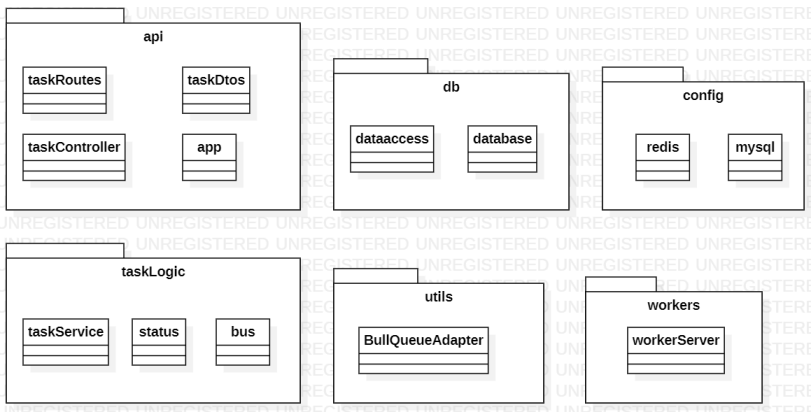
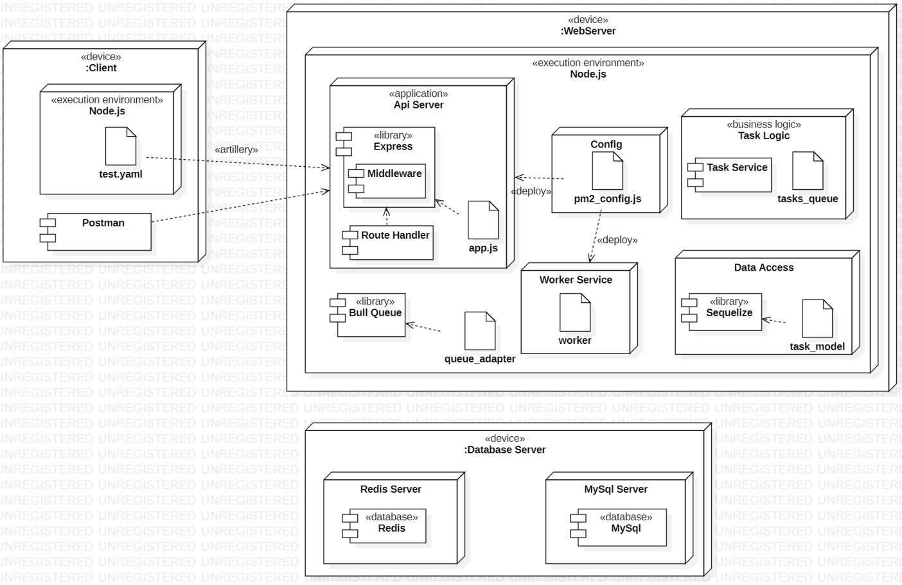

# Arquitectura de la Solución

Vamos a desarrollar una solución modular para manejar llamadas a un servicio externo que no se comporta de forma estable. 

Para ello, implementaremos el patrón Circuit Breaker, que permitirá controlar y gestionar los fallos de forma efectiva, asegurando la disponibilidad y la capacidad de respuesta del sistema.

## Requerimientos Funcionales

**RF1:** Llamadas a un servicio externo inestable.

Generar un endpoint que permita realizar llamadas a un servicio externo.
Este servicio debe poder configurarse para simular diferentes comportamientos: respuestas inmediatas, retrasos y fallos.

**RF2:** Implementar y gestionar el Circuit Breaker.

El servicio debe implementar un Circuit Breaker para manejar los fallos del servicio externo.
El estado del Circuit Breaker debe registrarse en logs para su monitoreo.

### Máquina de Estado del Circuito


## Componentes de la Arquitectura

**API REST:** Arquitectura utilizada para las APIs del Circuit Breaker y el Servicio Externo, gestionando las solicitudes y respuestas entre ambos componentes.

**Circuit Breaker**: Componente que monitorea las llamadas al Servicio Externo, interrumpiéndolas si se detectan fallos recurrentes para prevenir sobrecargas y mejorar la disponibilidad del sistema.

**Logger**: Utilizado para registrar eventos y estados del Circuit Breaker, facilitando la monitorización y depuración del sistema.

## Vista de Descomposición

### Representación Primaria



### Catálogo de Elementos

**app:** archivos con la función de configurar y lanzar un servidor Express que se utilizará como las API del `Circuit Breaker` y el `External Service`. Actúa como el punto de entrada de la ejecución de cada uno.

**controller:** contiene los endpoints de las APIs (configuración y obtención de estado del servicio externo). Utiliza los servicios, y define el status y respuestas de las requests.

**config:** contiene las variables de configuración del servicio externo, como la configuración predeterminada del circuit breaker (tiempo de espera, número de intentos y tiempo de reposo).

**routes:** define las rutas para cada endpoint.

**service:** define la lógica de configuración y obtención de información del servicio externo a partir del circuit breaker.

**circuitBreaker:** supervisa las llamadas al servicio externo y, cuando detecta un fallo repetido, "abre" el circuito para evitar más intentos fallidos.

**logger:** registra en un archivo todos los estados del funcionamiento del circuit breaker en tiempo de ejecución.

**errorHandler:** maneja las excepciones del cliente sobre el circuit breaker.

### Decisiones de Arquitectura

Se hace énfasis en el principio de diseño de cohesión `Common Closure Principle` (CCP), enfocandonos en la agrupación conjunta de clases estrechamente relacionadas, como atributo de `mantenibilidad`.

## Vista de Uso

### Representación Primaria


### Decisiones de Arquitectura

Se hace énfasis en la clara separación de responsabilidades, cumpliendo así con el `Single Responsability Principle` (SRP). Cada clase puede ser modificada de manera independiente sin afectar negativamente a las demás. Esta decisión mejora la mantenibilidad y la flexibilidad del sistema en general.

## Vista de Despliegue

### Representación Primaria



### Catálogo de Elementos

A continuación se consideran elementos relevantes para este diagrama:

**Client**: El cliente se comunica con la API de Circuit Breaker a través de aplicaciones como `cURL` o `Postman`.

**Execution Environment:** Ambiente de ejecución para las librerías de Node, incluidas `Winston`, `Opposum`, `Express`, `Axios` y `dotenv`.

**APIs**: las APIs tienen una arquitectura REST, basadas en la biblioteca `Express`de Node.js. Los endpoints de la API del Circuit Breaker se comunica con los endpoints de la API del External Service respectivamente.

**Config**: La configuración de los parámetros de funcionamiento del servidor externo pueden ser modificados por el Circuit Breaker en runtime. 

### Decisiones de Arquitectura

Por un lado, la independencia de los sistemas descritos en el patrón de Martin Fowler, sostuvo la decisión de remarcar el desacoplamiento de los módulos implementados: el servidor externo como una aplicación independiente al Circuit breaker.

En cuanto a la elección de tecnologías, se seleccionaron en base a la compatibilidad entre sí, a partir del entorno de `Node`.

## Patrones

**Gatekeeper:** El Circuit Breaker abre el circuito después de detectar un número configurable de fallos, previniendo que nuevas solicitudes alcancen el servicio externo problemático y, por ende, actúa como mecanismo de protección interno de fallos en cascada. Al limitar el número de solicitudes que se envían a un servicio externo fallido, el Circuit Breaker ayuda a evitar la sobrecarga tanto del servicio externo como del sistema interno que maneja las fallas.

**SOA:** SOA es una arquitectura que se enfoca en servicios desacoplados que pueden interactuar entre sí. En este contexto, el `Circuit Breaker Service` maneja las solicitudes y controla el acceso al servicio externo, consumiendo la API que proporciona el `Circuit Breaker Service` mediante solicitudes HTTP. Además, los servicios están desacoplados, permitiendo que cada uno evolucione de manera independiente, dando lugar al atributo de calidad *Escalabilidad*.

## Tácticas

**Audit, Timestamp:** registramos los eventos con tiempo para detectar anomalías y errores a través del sistema de logging implementado y utilizado por el breaker, para su posterior análisis y auditoría.

**Retry:** el breaker reintenta las operaciones de comunicación con el servidor externo después de un fallo. El número máximo de reintentos está configurado antes de realizar la request. 

**Reconfiguration:** el breaker tiene la capacidad de reajustar ciertos parametros de configuración del servidor externo como el porcentaje transitorio y no transitorio de fallas, además de los reintentos.

**State Resynchronization:** el circuit breaker cambia su estado cuando se realiza un evento de fallo como se indicó en el diagrama anterior, asegurando la consistencia del sistema.

**Exception Prevention:** la implementación del circuit breaker a traves de `Opposum` previene excepciones y fallas del servicio externo, aumentando la performance y disponibilidad del sistema.

**Bound Execution Times:** la inicialización del circuit breaker implementada da la opción de configuración de la propiedad de timeout, donde se establece el límite máximo para la ejecución de tareas en el servidor externo. 

**Couple-Time Parameterization, Configuration-Time Binding, Couple-Time Parameterization:** A través del uso de un archivo .env, el paquete dotenv y el método dotenv.config(), se definieron variables de entorno que afectan el comportamiento del sistema. Por ende se definieron parámetros al instanciar el circuit breaker que son interpretados en tiempo de ejecución, en lugar de en tiempo de compilación. Por otro lado, su endpoint para configurar las variables relacionadas al comportamiento de los servicios del servidor externo (como el timeout y el porcentaje de error de threshold) nos permite realizar binding en tiempo de ejecución. 

**Redistribute Responsibilities:** la reasignación de las responsabilidades tanto en el módulo del servicio externo como en el circuit breaker, a través de la descomposición en archivos como se mostró en el diagrama anterior, mejora la cohesión y reduce la complejidad del funcionamiento que aportan sus respectivas clases. Nos permite que cada una de ellas tenga un propósito más definido y menos sobrecargado de tareas, apuntando al principio SRP. 

**Use an Intermediary:** a tráves de las biblioteca `Express` introducimos middlewares que gestionan la comunicación entre los dos módulos. También ocurre especificamente con el circuit breaker que utiliza la biblioteca `Axios`, encargandose de obtener el estado e información del servidor externo.

**Manage Service Interactions:** el sistema implementado para el patrón, nos permite controlar y gestionar cómo el servicio del breaker y el servidor externo interactúan entre sí, después de haber sido desplegado.

## ADRs (Architectural Decision Records)

### ADR 001 - Uso de Winston para registrar el estado del Circuit Breaker en Logs.

**Estado:** Aceptado

**Contexto:** Es necesario monitorear y registrar el estado del Circuit Breaker para asegurar su correcto funcionamiento.

**Decisión:** Se utilizará la librería Winston para generar los logs para registrar los estados y eventos del Circuit Breaker.

**Atributos de Calidad Satisfechos:**

- **Disponibilidad:** Winston permite detectar y resolver problemas rápidamente al proporcionar registros detallados sobre el estado de la aplicación y los errores que puedan ocurrir.
-  **Mantenibilidad:** El uso de Winston facilita la depuración y mejora del sistema al proporcionar información clara y estructurada sobre el comportamiento de la aplicación. 
- **Seguridad:** Winston contribuye a la seguridad general al registrar accesos y eventos sospechosos que podrían indicar un intento de ataque.

**Consecuencias:**

-  **Ventajas:** Proporciona una visión clara del comportamiento del Circuit Breaker, optimización, actualización, rastreo y limpieza de la aplicación.
-  **Desventajas:** Puede generar una gran cantidad de logs, requiriendo gestión adecuada. La configuración y el manejo de los registros pueden añadir complejidad al sistema.

---

### ADR 002 - Uso de Axios para realizar llamadas al servicio externo.

**Estado:** Aceptado

**Contexto:** Para interactuar con el servicio externo poco confiable, necesitamos una herramienta que nos permita realizar llamadas HTTP de manera eficiente y manejable. Además, requerimos características avanzadas como la configuración de reintentos y el manejo de errores.

**Decisión:** Se utilizará la librería Axios para realizar las llamadas HTTP al servicio externo para obtener su estado.

**Atributos de Calidad Satisfechos:**

- **Performance:** Axios permite realizar llamadas HTTP de manera eficiente y configurarlas para manejar reintentos, lo que mejora el rendimiento en escenarios de fallos transitorios.
- **Modificabilidad:** La API de Axios es sencilla y clara, lo que facilita la integración y el mantenimiento del código que realiza llamadas HTTP. Además, su soporte para interceptores permite manejar de forma centralizada los errores y reintentos.
- **Disponibilidad:** Al permitir configurar reintentos automáticos para las solicitudes fallidas, Axios ayuda a mejorar la disponibilidad del sistema al manejar fallos temporales de manera eficiente.
- **Interoperabilidad**: Al utilizar HTTP como protocolo de comunicación, Axios permite que el servicio de Circuit Breaker se comunique con el servidor externo, independientemente de las tecnologías utilizadas en cada servicio.

**Consecuencias:**

- **Ventajas:** Permite configurar y manejar reintentos de manera sencilla, facilita el manejo de errores con interceptores y es un soporte para cancelar solicitudes, útil en escenarios de Circuit Breaker.
- **Desventajas:** Puede introducir una sobrecarga adicional en el rendimiento debido a la gestión de reintentos y el manejo de errores.

---

### ADR 003 - Uso de Opossum para implementar la API de Circuit Breaker.

**Estado:** Aceptado

**Contexto:** El patrón Circuit Breaker ayudará a prevenir qué fallas afecten la disponibilidad y la estabilidad de nuestra aplicación, cuando ésta se comunica con un servicio externo inestable.

**Decisión:** Se utilizará la librería Opossum para implementar el patrón Circuit Breaker en nuestro sistema.

**Atributos de Calidad Satisfechos:**

- **Disponibilidad:** Opossum permite aislar fallas en el servicio externo, mejorando la disponibilidad del sistema al cortar el circuito cuando se detectan errores repetidos.
- **Performance:** Implementar el patrón Circuit Breaker con Opossum ayuda a mejorar la resiliencia de la aplicación, ya que previene qué fallas del servicio externo afecten negativamente a toda la aplicación.
- **Usabilidad:** Opossum proporciona una API clara y sencilla para implementar el patrón Circuit Breaker.

**Consecuencias:**

- **Ventajas:** Mejora la disponibilidad y el registro de logs con mayor facilidad. Además, la optimización y monitorización del sistema al manejar fallas de manera eficiente, configurando opciones como el tiempo de espera, el número de intentos y tiempo de reposo antes de reabrir el circuito.
- **Desventajas:** Añade complejidad al sistema y una sobrecarga mínima adicional al introducir un nuevo componente (el Circuit Breaker) que necesita ser configurado y gestionado adecuadamente.

---

### ADR 004 - Uso de Redis para almacenar el estado del Circuit Breaker.

**Estado:** Rechazado.

**Contexto:** Se consideró utilizar Redis como almacenamiento para mantener el estado del Circuit Breaker, incluyendo contadores y configuraciones.

**Decisión:** No se utilizará Redis para almacenar el estado del Circuit Breaker debido a la complejidad adicional que introduce en la configuración, gestión y mantenimiento del sistema.

**Consecuencias:**

- **Ventajas:** La decisión de no utilizar Redis puede resultar en una implementación más simple y directa del patrón de Circuit Breaker.
- **Desventajas:** En caso de una extensión de los requerimientos y nuevas adaptaciones futuras, la implementación actual podría limitar algunas capacidades avanzadas de gestión de estado que Redis podría proporcionar.

## Tecnologías

**Node.js:** Plataforma de ejecución para el desarrollo de las aplicaciones.

**Typescript**: Superconjunto de JavaScript que añade tipos estáticos.

**Express.js:** Framework para la creación de la API REST.

**Axios.js:** Librería de cliente HTTP basada en promesas. Ofrece solicitudes HTTP desde el navegador y Node.js.

**Winston.js:** Biblioteca de registro para Node.js. Ofrece una interfaz para registrar información, errores y datos de depuración.

**Opossum.js:** Librería para implementar el patrón Circuit Breaker en aplicaciones Node.js.

### Prompts Chat GPT

`Existe alguna librería de Node.js para el patron circuit breaker de martin fowler?`

ChatGPT: 

```
Sí, en Node.js hay varias librerías que puedes utilizar para implementar el patrón Circuit Breaker de Martin Fowler. Algunas de las más populares y bien mantenidas son:

Opossum: Es una librería de Circuit Breaker para Node.js que proporciona capacidades de gestión de errores y fallbacks. Puedes encontrar más información y ejemplos en npm opossum.

Brakes: Otra opción popular que proporciona un Circuit Breaker para aplicaciones Node.js. Incluye soporte para promesas y callbacks, y permite configuraciones avanzadas. Puedes encontrar más información y ejemplos en npm brakes.

Hystrixjs: Inspirada por el Hystrix de Netflix, esta librería ofrece funcionalidades avanzadas de Circuit Breaker, así como monitoreo y métricas integradas. Puedes encontrar más información y ejemplos en npm hystrixjs.
```

## CI/CD

Modificar el archivo `.env` para adaptar la configuración del Circuit breaker y para la configuración default (inicial) del servidor externo.

**Instalación de paquetes:**

`npm install`

*Globales*:

`npm install -g typescript`

```
"scripts": {
    "build": "tsc",
    "dev:circuitBreakerService": "ts-node circuitBreakerService/app.ts",
    "start:circuitBreakerService": "node dist/circuitBreakerService/app.js",
    "dev:externalService": "ts-node externalService/app.ts",
    "start:externalService": "node dist/externalService/app.js"
},
"devDependencies": {
    "@types/express": "^4.17.11",
    "@types/node": "^14.14.31",
    "@types/opossum": "^8.1.7"
},
"dependencies": {
    "axios": "^0.21.1",
    "dotenv": "^8.2.0",
    "express": "^4.17.1",
    "ts-node": "^9.1.1",
    "opossum": "^5.1.2",
    "winston": "^3.3.3"
}  
```

**Instalación de `cURL`**:

*Windows*: `curl.se/windows`

*MacOS*: `brew install curl`

*Linux*: 

`sudo apt-get update`

`sudo apt-get install curl`

**Compilación:**

`tsc`

**Ejecución:**

*Circuit Breaker*

`npm run dev:circuitBreakerService`

`npm run start:circuitBreakerService`

*Servidor Externo*

`npm run dev:externalService`

`npm run start:externalService`

**Línea de Comandos:**

Además de Postman, una herramienta común para realizar las llamadas HTTP es `cURL`.

GET: `curl http://localhost:3000/api/fetch-data`

POST: `curl -X POST -H "Content-Type: application/json" -d '{"retry": "", "failure": "", "transient_failure": ""}' http://localhost:3000/api/configure-service`
