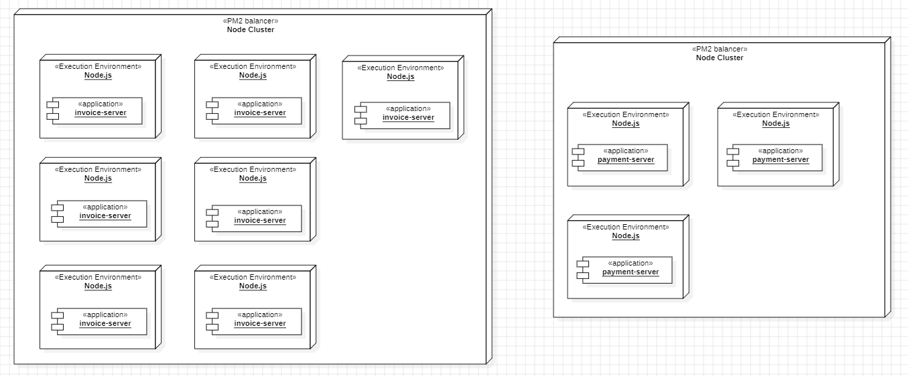

# ADR 1: Elección del Caso 5 como la Mejor Implementación del Sistema de Ventas, fundamentalmente en términos de Performance

La decisión fue influenciada por múltiples factores tecnológicos y de desarrollo. 
A continuación dividiremos las fuerzas de decisión de diseño a través de atributos de calidad para su mayor entendimiento:

**Performance**: Se buscó minimizar las medidas de respuesta de la performance como lo son la duración de las solicitudes HTTP (con/sin respuestas válidas - Latency/Deadline), el número de requests procesadas por segundo (Throughput), evaluando así distintas configuraciones y arquitecturas.

**Escalabilidad**: La solución debía ser capaz de soportar un alto volumen de transacciones concurrentes (táctica Introduce Concurrency), y para eso *PM2* nos ayudó a invocar múltiples instancias (junto con las tácticas Redundant Spare, Ignore Faulty Behavior y Component Replacement) para poder escalar y balanceo de carga (táctica Load Balancing) para evitar cuellos de botella.

**Costo del proyecto**: Se evaluó un balance entre el costo de infraestructura y el rendimiento, priorizando opciones que escalen horizontalmente sin aumentar significativamente el gasto operativo.

**Integrabilidad**: Se consideró la facilidad de integración con la arquitectura existente (línea de base), como una cola de workers y la gestión operativa de recursos.

**Mantenibilidad**: Un factor importante fue la simplicidad de la implementación y la minimización de cambios en el código (como por ejemplo, en la línea base se utilizó Axios para desacoplar las APIs - táctica Use An Intermediary). En el caso de la optimización a nivel de base de datos, como la base de datos de *MySql* y el ORM *Sequelize* funcionan correctamente, sumado a la modificación y respaldo que se debe considerar realizar en un sistema de ventas, no se favorece mucho este atributo de calidad, mientras que en los otros dos casos sí. 

**Deployabilidad**: Gracias a la utilización de *Docker* para facilitar el despliegue de bases de datos , *Redis* no fue la excepción. Por otro lado, *PM2* nos permite centralizar el deployment en un solo archivo de script (táctica Script Deployment)

**Seguridad**: Con *PM2*, Se agregó una auditoría (táctica Audit) extra de logs (ademas de la de *Grafana K6* y *MongoDB*) con timestamp.

**Disponibilidad**: Además de la implementación del caso base con transacciones y rollback con *Sequelize* (tácticas RollBack y Transactions), con *BullMQ*, se configuró el número y tiempo entre reintentos (táctica Retry) al crear facturas, como logs cuando existían fallas. Además con *PM2* se tuvo la oportunidad de monitorizar el CPU y los recursos (táctica Monitor). 

## Decisión 

Hemos decidido implementar la solución del Caso 5, que combina *Bull Queue* (con *Redis*) para el manejo de eventos con buffer y múltiples copias de cómputo mediante PM2 en la API de pagos y facturación. Esta configuración ha demostrado ser la más eficiente en términos de latencia y escalabilidad.

## Justificación

Tras evaluar distintas configuraciones, se seleccionó el Caso 5 porque ofrece un equilibrio óptimo entre rendimiento (performance), disponibilidad y escalabilidad, sin incurrir en costos excesivos de infraestructura. 

Su combinación de *Bull Queue* con *Redis* (para gestionar eventos con buffer) y múltiples copias de cómputo mediante *PM2* permitió manejar eficientemente la concurrencia, reducir la latencia y optimizar la respuesta del sistema sin comprometer su estabilidad.

### Alternativas Analizadas

**Procesamiento síncrono con optimización a nivel de base de datos (Caso 2)**

Si bien todos los casos usaron async/await y Promise.all, el problema no era la falta de asincronía, sino que en estos casos la API procesaba las solicitudes de facturación directamente, sin un mecanismo de buffer ni distribución de carga.

Se optimizaron las consultas a MySQL con índices y includes solo con los parámetros necesarios, lo que mejoró la eficiencia en lectura, pero no resolvió el problema de concurrencia en la escritura de facturas.

Se consideró agregar CQRS con MongoDB para lectura, pero se descartó debido a su complejidad y a que la separación entre lectura y escritura ya estaba bien definida (se leen clientes y productos, mientras que solo se modifican facturas y sus detalles).

**Uso de un buffer con Bull Queue y Redis (Caso 3)**

Introducir un buffer permitió desacoplar la generación de facturas del procesamiento en la API, evitando bloqueos y mejorando la latencia.

Sin embargo, este enfoque por sí solo no mejoraba la capacidad de cómputo para procesar las facturas más rápido, ya que las instancias de la API seguían teniendo una capacidad limitada.

**Ejecución multihilo y balanceo de carga con PM2 (Caso 4)**

Se configuraron múltiples copias de la API para manejar más solicitudes en paralelo.

Esto mejoró la concurrencia, pero sin una estrategia de buffer como Bull Queue, las facturas podían generar picos de carga en la base de datos sin control adecuado.

**Caso 5: Combinación de Bull Queue (Caso 3) + PM2 (Caso 4)**

Bull Queue con Redis permitió manejar eventos con buffer, evitando bloqueos y controlando la carga sobre la base de datos.

PM2 permitió escalar horizontalmente con múltiples instancias de la API, mejorando la capacidad de procesamiento.

Esta combinación maximizó la eficiencia del sistema en escenarios de alta concurrencia.

### Suposiciones

Redis será altamente disponible y podrá escalar horizontalmente si es necesario.

La infraestructura soportará la sobrecarga de instancias adicionales generadas por PM2.

La latencia introducida por los reintentos en Bull Queue será manejable dentro de los tiempos de SLA definidos.

### Resultados de Evaluación

Las pruebas de carga demostraron que el Caso 5 mejoró los tiempos de respuesta en comparación con las otras estrategias, manteniendo un throughput estable incluso en escenarios de alta concurrencia. Esta configuración permitió absorber picos de carga sin comprometer la estabilidad del sistema y con un impacto controlado en los costos de infraestructura.

## Estado

**Aceptado**

## Consecuencias

**Positivas**:

- Reducción de la latencia: Disminución del tiempo de duración de las solicitudes HTTP en comparación con otras estrategias evaluadas.

- Mayor tolerancia a carga alta: La arquitectura basada en eventos permite manejar grandes volúmenes de transacciones sin afectar la estabilidad del sistema.

- Optimización del uso de recursos: *PM2* permite escalar instancias de la API sin necesidad de reiniciar todo el sistema, asegurando una gestión eficiente de recursos.

- Manejo eficiente de eventos: *Redis* actúa como un buffer que desacopla la API de facturación del procesamiento de eventos en *BullMQ*, optimizando la respuesta en picos de carga.

- Escalabilidad sin altos costos: La solución permite aumentar la capacidad del sistema sin incrementar significativamente los costos de infraestructura.

- Resiliencia: Gracias a la táctica Retry, los fallos transitorios en la facturación pueden recuperarse sin pérdida de datos.

**Negativas**:

- Mayor complejidad operativa: La administración y monitoreo de colas en Redis requiere herramientas adicionales y configuraciones de optimización.

- Supervisión activa de *PM2*: Es necesario monitorear el uso de recursos para evitar sobreutilización y garantizar una distribución equitativa de las instancias.

- Dependencia en *Redis*: Si *Redis* presenta problemas de disponibilidad, el buffer de eventos puede verse afectado, impactando la generación de facturas.

- Configuración avanzada de reintentos: Un mal ajuste de los reintentos en *BullMQ* podría generar acumulación de tareas pendientes o saturación en el sistema.

